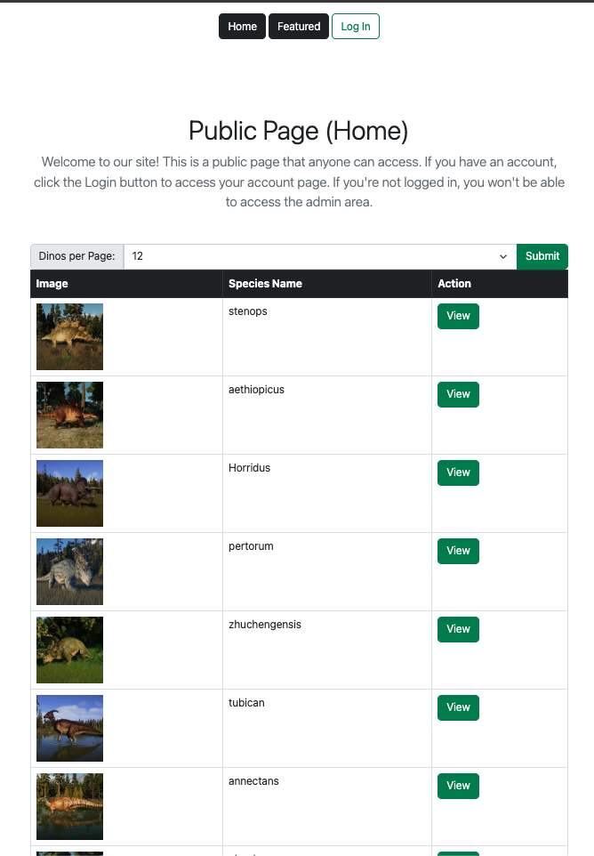
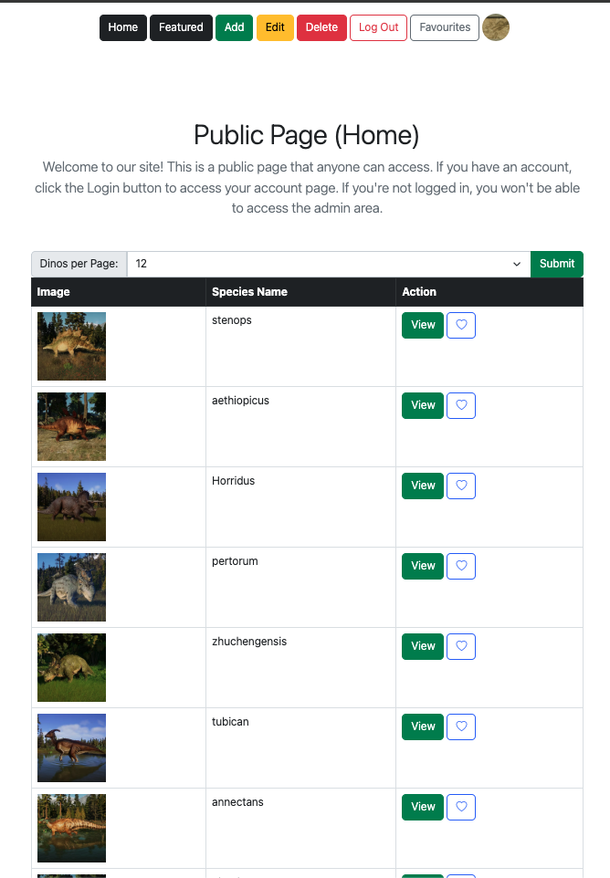
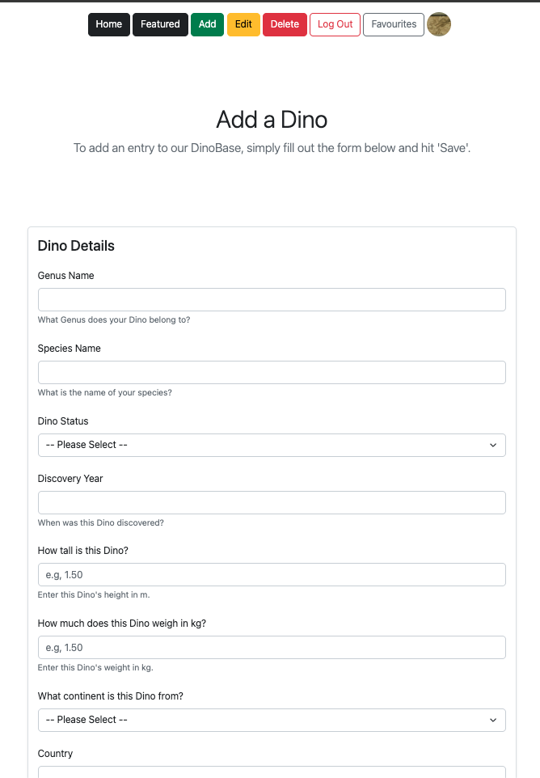
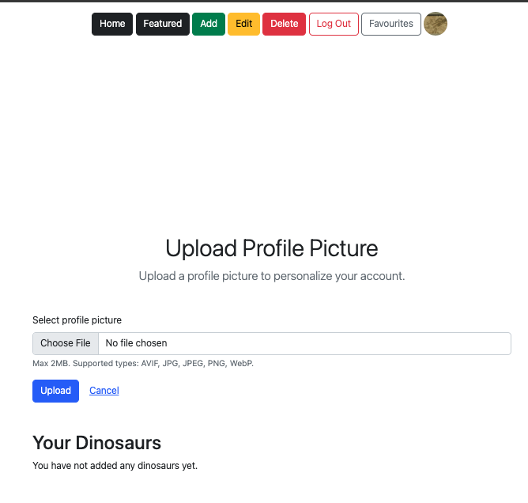

# 🦕 DinoBase

**DinoBase** is a PHP-based dinosaur catalogue and management system. It allows administrators to manage a database of dinosaur species, complete with detailed statistics, descriptions, and images. The application is containerized using Docker for easy deployment and development.

## 📸 Screenshots

<table>
  <tr>
    <th width="25%">Landing Page</th>
    <th width="25%">Admin Dashboard</th>
    <th width="25%">Add Entry</th>
    <th width="25%">User Profile</th>
  </tr>
  <tr>
    <td valign="top">
      
      <br><br>
      <em>The Landing page provides a gallery view featuring entries from our database, pagination, a featured-dinos page and log-in page.</em>
    </td>
    <td valign="top">
      
      <br><br>
      <em>The homepage with full CRUD functionality enabled.</em>
    </td>
    <td valign="top">
      
      <br><br>
      <em>Add an entry into the database.</em>
    </td>
    <td valign="top">
      
      <br><br>
      <em>Upload your own profile picture and view your database entries.</em>
    </td>
  </tr>
</table>

## ✨ Key Features

*   **Detailed Catalogue**: View a detailed list of dinosaurs including genus, species, era, size, weight, and location.
*   **Search & Filter**: Search functionality to find dinosaurs by name or filter by criteria.
*   **Authentication System**: Secure login system for administrators.
*   **CRUD Operations**: Full Create, Read, Update, and Delete capabilities for managing dinosaur records.
*   **Favorites System**: Users can mark their favorite dinosaurs for quick access.
*   **Profile Management**: Admins can update their profiles and upload profile pictures.
*   **Responsive Design**: Built with Bootstrap for a modern, responsive user interface.

## 🛠️ Technology Stack

*   **Backend**: PHP 8.4
*   **Database**: MySQL
*   **Frontend**: HTML5, CSS3, Bootstrap 
*   **Server**: Apache HTTP Server
*   **Containerization**: Docker
*   **Database Management**: phpMyAdmin (included in dev environment)

## 🚀 Getting Started

This project is fully containerized. You can get it up and running with just a few commands.

### Prerequisites

*   **Docker Desktop** (or Docker Engine + Docker Compose) installed on your machine.

### Installation

1.  **Clone the repository**:
    ```bash
    git clone <repository-url>
    cd dinobase-project
    ```

2.  **Start the environment**:
    Run the following command in the project root (where `compose.yml` is located):
    ```bash
    docker-compose up -d --build
    ```

3.  **Access the application**:
    *   **Main Website**: Open your browser and visit `http://localhost:8080` (or `http://localhost:8000`, check your specific port mapping if customized).
    *   **phpMyAdmin**: Visit `http://localhost:8081` to manage the database directly.

### Demo Credentials

You can log in with the following demo account:

*   **Username**: `ty`
*   **Password**: `tdawg95`

### Creating Your Own User

Since there is no public registration page, you can create a new user manually using the command line and SQL.

1.  **Generate a Password Hash**:
    Run the following command in your terminal to create a secure hash for your password (replace `yourpassword` with your desired password):
    ```bash
    docker-compose exec web php -r "echo password_hash('yourpassword', PASSWORD_DEFAULT);"
    ```

2.  **Insert User into Database**:
    Access the database (e.g., via phpMyAdmin at `http://localhost:8081`) and run the following SQL query in the `group_1_catalogue_admin` table:
    ```sql
    INSERT INTO group_1_catalogue_admin (users, hashed_pass)
    VALUES ('your_username', '$2y$10$YourGeneratedHashHere...');
    ```

## 🗄️ Database Schema

The core database `dinobase` consists of the following structure:

*   **`dinobase`**: The main table storing dinosaur records (Name, Status, Era, Size, Description, etc.).
*   **`group_1_catalogue_admin`**: Stores administrator accounts and hashed passwords.
*   **`favourites`**: Maps relationships between users and their favorite dinosaurs.
*   **`profile_pics`**: specific table for user profile settings.

## 📂 Project Structure

```
dinobase-project/
├── data/               # SQL initialization scripts and assets
├── private/            # Core PHP logic, functions, and db connection
├── public/             # Public facing PHP pages (index, login, browse)
├── compose.yml         # Docker Compose configuration
├── Dockerfile          # PHP/Apache Docker image definition
└── apache-dirlist.conf # Apache configuration
```

## 🤝 Contributors

Special thanks to my team members who contributed to the 🦕 DinoBase! 
<p>longtran2092004 | Electronic-than | jrussell43</p>
